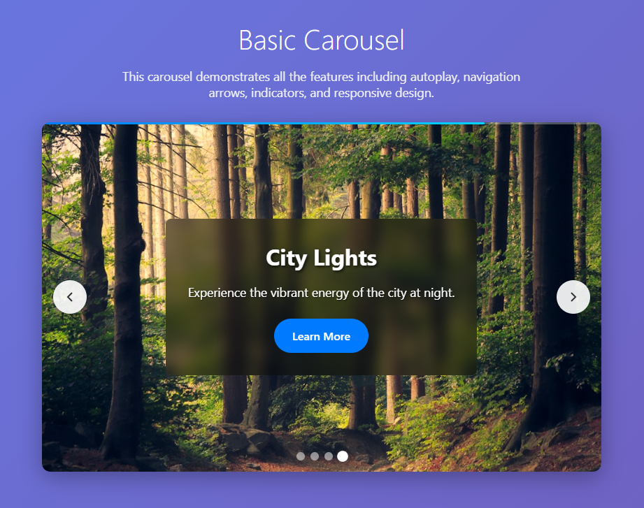

# ng-custom-carousel



A modern, customizable carousel component for Angular 20+ built with signals and standalone components. This library provides a feature-rich carousel with no third-party dependencies, using only custom SCSS for styling.

## Features

- **Angular 20+ Ready** - Built with the latest Angular features
- **Signal-based** - Uses modern Angular signals for inputs and outputs
- **Customizable** - Extensive configuration options
- **Responsive** - Mobile-first design with responsive breakpoints
- **Accessible** - ARIA labels and keyboard navigation support
- **Smooth Animations** - CSS transitions and transforms
- **Autoplay Support** - Configurable autoplay with progress bar
- **Touch Friendly** - Optimized for mobile devices
- **No Dependencies** - Pure Angular + SCSS implementation

## Installation

```bash
npm install ng-custom-carousel
```

## Usage

### Basic Usage

```typescript
import { NgCustomCarousel, CarouselItem, CarouselConfig } from 'ng-custom-carousel';

@Component({
  selector: 'app-example',
  standalone: true,
  imports: [NgCustomCarousel],
  template: `
    <ng-custom-carousel 
      [items]="carouselItems" 
      [config]="carouselConfig"
      (slideChange)="onSlideChange($event)"
      (carouselClick)="onCarouselClick($event)">
    </ng-custom-carousel>
  `
})
export class ExampleComponent {
  carouselItems: CarouselItem[] = [
    {
      id: 1,
      image: 'https://example.com/image1.jpg',
      title: 'Slide 1',
      description: 'This is the first slide',
      link: 'https://example.com/slide1'
    },
    {
      id: 2,
      image: 'https://example.com/image2.jpg',
      title: 'Slide 2',
      description: 'This is the second slide',
      link: 'https://example.com/slide2'
    }
  ];

  carouselConfig: CarouselConfig = {
    autoplay: true,
    autoplaySpeed: 5000,
    showArrows: true,
    showIndicators: true,
    showTitle: true,
    showDescription: true,
    infinite: true,
    responsive: true,
    height: '400px',
    width: '100%'
  };

  onSlideChange(event: { currentIndex: number; item: CarouselItem }) {
    console.log('Slide changed to:', event.currentIndex, event.item);
  }

  onCarouselClick(item: CarouselItem) {
    console.log('Carousel item clicked:', item);
  }
}
```

### Configuration Options

```typescript
interface CarouselConfig {
  autoplay?: boolean;           // Enable/disable autoplay (default: true)
  autoplaySpeed?: number;       // Autoplay interval in milliseconds (default: 5000)
  showArrows?: boolean;         // Show navigation arrows (default: true)
  showIndicators?: boolean;     // Show slide indicators (default: true)
  showTitle?: boolean;          // Show slide titles (default: true)
  showDescription?: boolean;    // Show slide descriptions (default: true)
  infinite?: boolean;           // Enable infinite loop (default: true)
  responsive?: boolean;         // Enable responsive behavior (default: true)
  height?: string;              // Carousel height (default: '400px')
  width?: string;               // Carousel width (default: '100%')
}
```

### Item Structure

```typescript
interface CarouselItem {
  id: string | number;          // Unique identifier
  image?: string;               // Background image URL
  title?: string;               // Slide title
  description?: string;         // Slide description
  link?: string;                // Optional link URL
  [key: string]: any;           // Additional custom properties
}
```

### Events

- `slideChange` - Emitted when the slide changes
- `carouselClick` - Emitted when a carousel item is clicked

## Development

### Prerequisites

- Node.js 18+
- Angular CLI 20+

### Setup

```bash
# Clone the repository
git clone https://github.com/muhammadawaisshaikh/ng-custom-carousel.git
cd ng-custom-carousel

# Install dependencies
npm install

# Build the library
npm run build:lib

# Start the demo app
npm start
```

### Build Commands

```bash
# Build library for development
npm run build:lib

# Build library for production
npm run package

# Build demo app
npm run build:demo

# Watch mode for development
npm run watch
```

### Testing

```bash
# Test the library
npm run test

# Test the demo app
npm run test:demo
```

## Styling

The carousel uses custom SCSS with CSS custom properties for easy theming. All styles are prefixed with `ng-carousel-` to avoid conflicts.

### Custom CSS Variables

You can override the default styles by setting CSS custom properties:

```scss
.ng-carousel-container {
  --carousel-primary-color: #007bff;
  --carousel-secondary-color: #00d4ff;
  --carousel-text-color: white;
  --carousel-overlay-opacity: 0.5;
}
```

## Browser Support

- Chrome 90+
- Firefox 88+
- Safari 14+
- Edge 90+

## Contributing

1. Fork the repository
2. Create a feature branch (`git checkout -b feature/amazing-feature`)
3. Commit your changes (`git commit -m 'Add some amazing feature'`)
4. Push to the branch (`git push origin feature/amazing-feature`)
5. Open a Pull Request

## License

This project is licensed under the MIT License - see the [LICENSE](LICENSE) file for details.

## Acknowledgments

- Inspired by modern carousel designs
- Built with Angular 20+ best practices
- Uses signal-based architecture for optimal performance

## Support

If you have any questions or need help, please open an issue on GitHub or contact the maintainers.
